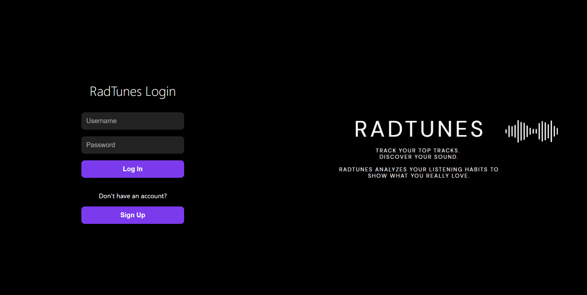
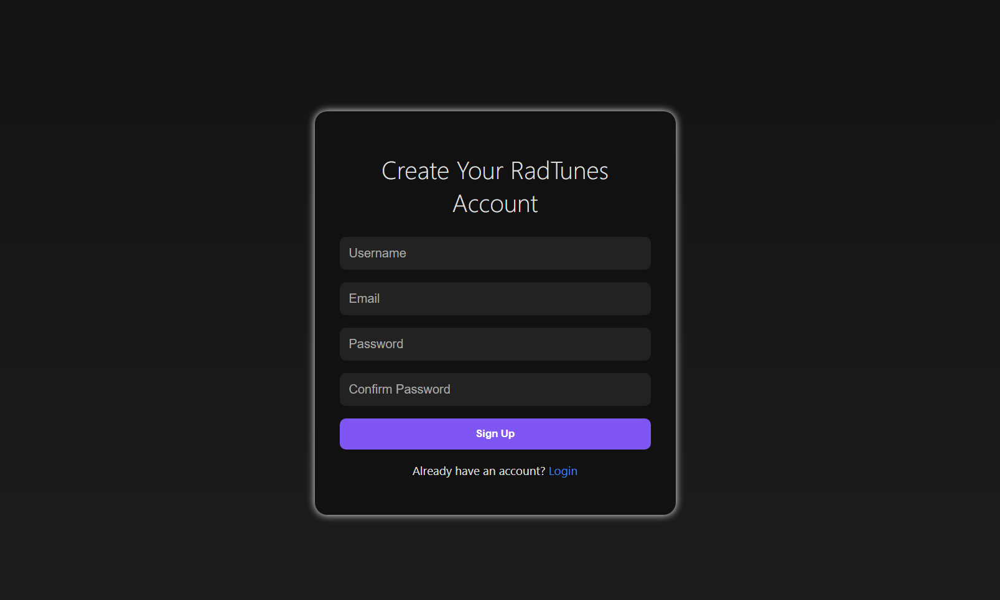
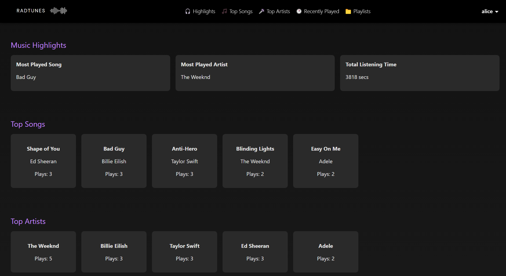
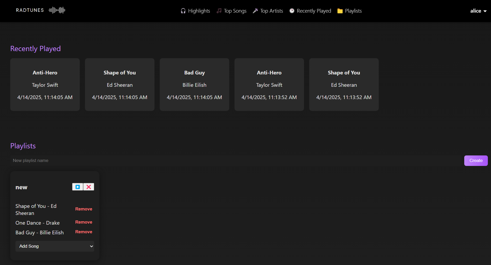

# 🎧 RadTunes

RadTunes is a full-stack music web application that lets users sign up, explore their top songs, artists, recent plays, and create playlists — all with a sleek UI and dynamic listening stats.

---

## 🚀 Features

- 🔐 User authentication (Sign Up / Login)
- 🎵 View Top Songs & Artists based on listening history
- 🕑 Track Recently Played songs
- 📁 Create, manage, and play custom playlists
- ✨ Music Highlights: Most played song, artist & total listening time
- 💅 Soft UI with hover animations

---

## 🛠️ Tech Stack

### Frontend
- **React**
- **React Router DOM**
- **CSS** (custom with glassmorphism & animations)
- Axios

### Backend
- **Express.js**
- **MySQL (via `mysql2` pool)**
- `express-async-handler` for cleaner async routes

---

## 🖼️ Screenshots

### LogIn Page

### SignUp Page

### HomePage

---

